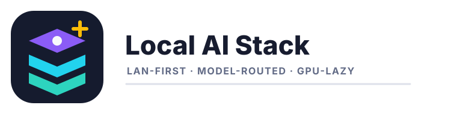

<p align="center">
  <a href="README.md">English</a> · <strong>中文</strong>
</p>

<p align="center">
  
</p>

<h1 align="center">Local AI Stack</h1>

<p align="center">
  <strong>面向本地文本与图片模型的轻量局域网 AI 工作台</strong><br>
  集成 Web 控制台、OpenAI-compatible 统一网关、懒加载模型 worker，以及便于扩展本地后端的模型注册中心。
</p>

<p align="center">
  <a href="https://www.python.org/"></a>
  <a href="#api-surface"></a>
  <a href="#quick-start"></a>
  <a href="#runtime-boundaries"></a>
</p>

<p align="center">
  <a href="#overview">项目概览</a> ·
  <a href="#architecture">架构</a> ·
  <a href="#quick-start">快速开始</a> ·
  <a href="#api-surface">API</a> ·
  <a href="#model-registry">模型注册</a> ·
  <a href="#operations">运维</a> ·
  <a href="#community-projects">参考项目</a> ·
  <a href="#license">许可证</a>
</p>

> [!IMPORTANT]
> 本仓库是本地部署脚手架。`models/` 下的模型权重、`outputs/` 下的生成图片、日志和虚拟环境都刻意不提交到 Git。

<a id="overview"></a>
## 项目概览

Local AI Stack 为单机或局域网 GPU 环境提供一个小型本地 AI 工作台。当前通过直接 OpenAI-compatible 代理暴露 Qwen 文本模型和 Qwen 图片模型，并提供一个轻量 Web UI；该 Web UI 同时作为外部客户端可使用的统一网关。

| 目标 | 已实现方法 | 边界 |
| --- | --- | --- |
| 让浏览器和外部工具使用本地模型 | `web_ui.py` 在 `8080` 端口提供 Web UI 和 `/v1` 网关 | 默认 API key 只适合开发环境 |
| 避免大模型 worker 常驻 | 文本和图片代理在首次请求时启动 worker，空闲后终止 | 通过终止进程释放 CUDA 显存 |
| 保持模型路由可编辑 | `model_registry.json` 定义聊天/图片模型、端点、健康检查、默认值和功能标签 | 新后端需要暴露兼容 API |
| 保留走向成熟 stack 的路径 | 架构说明映射到 Open WebUI、LiteLLM、vLLM、SGLang、ComfyUI 和 LocalAI 的产品/架构形态 | 参考的是形态和分层，不复制代码 |

当前默认服务：

| 层 | 本机 URL | 局域网 URL | 说明 |
| --- | --- | --- | --- |
| Web 控制台 | `http://127.0.0.1:8080` | `http://<LAN_IP>:8080` | 浏览器控制台和 Stack 状态页 |
| 统一网关 | `http://127.0.0.1:8080/v1` | `http://<LAN_IP>:8080/v1` | 外部工具可只接这一个 base URL |
| 文本代理 | `http://127.0.0.1:8000/v1` | `http://<LAN_IP>:8000/v1` | 懒加载 Qwen 文本 worker |
| 图片代理 | `http://127.0.0.1:8001/v1` | `http://<LAN_IP>:8001/v1` | 懒加载 Qwen 图片 worker |

默认 API key：`local-dev-key`。

<a id="architecture"></a>
## 架构

<p align="center">
  <a href="docs/assets/stack-architecture.svg">
    
  </a>
</p>
<p align="center"><em>图 1｜Stack 将浏览器 UI、统一网关、懒加载模型代理、worker 和运维状态界面分层。</em></p>

<p align="center">
  <a href="docs/assets/console-overview.svg">
    
  </a>
</p>
<p align="center"><em>图 2｜Web UI 提供模型选择、文本/图片入口和 stack 健康状态可视化。</em></p>

<details>
<summary><strong>展开请求流转图</strong></summary>
<br>

<p align="center">
  <a href="docs/assets/request-flow.svg">
    
  </a>
</p>
<p align="center"><em>图 3｜外部客户端可以调用统一网关，由它把聊天和图片请求路由到已注册本地后端。</em></p>

</details>

服务分层详见 [docs/STACK.md](docs/STACK.md)。接入说明和本地参考快照位于 [integrations/](integrations/) 与 [references/](references/)。

<a id="quick-start"></a>
## 快速开始

创建脚本预期的本地 Python 环境：

```bash
git clone https://github.com/rudykon/ai-stack.git
cd ai-stack

python3 -m venv .venv
.venv/bin/pip install -r requirements.txt
```

下载或放置模型权重到 `models/`。文本模型 helper 会从 ModelScope 下载默认 Qwen 文本模型：

```bash
.venv/bin/python download_model.py
```

按需启动 Web UI、统一网关、文本代理和图片代理：

```bash
./api.sh
```

启动后访问：

```text
Web UI：      http://127.0.0.1:8080
Gateway：     http://127.0.0.1:8080/v1
局域网 Web：  http://<LAN_IP>:8080
局域网网关：  http://<LAN_IP>:8080/v1
API key：     local-dev-key
```

使用期间保持终端打开。按 `Ctrl+C` 会停止 Web UI、两个 API 代理以及它们启动的 worker。

常用辅助命令：

```bash
./api.sh status
./api.sh stop
```

<a id="api-surface"></a>
## API Surface

统一网关支持：

```text
GET  /v1/models
POST /v1/chat/completions
POST /v1/images/generations
```

通过网关调用文本模型：

```bash
curl http://127.0.0.1:8080/v1/chat/completions \
  -H 'Content-Type: application/json' \
  -H 'Authorization: Bearer local-dev-key' \
  -d '{
    "model": "Qwen/Qwen3.6-27B",
    "messages": [{"role": "user", "content": "Say OK in one word."}],
    "max_tokens": 8,
    "temperature": 0
  }'
```

通过网关调用图片模型：

```bash
curl http://127.0.0.1:8080/v1/images/generations \
  -H 'Content-Type: application/json' \
  -H 'Authorization: Bearer local-dev-key' \
  -d '{
    "model": "Qwen/Qwen-Image-2512",
    "prompt": "A red circle on a white background",
    "size": "512x512",
    "n": 1,
    "response_format": "b64_json"
  }'
```

必要时也可以直连代理端点：

```text
Text API:  http://127.0.0.1:8000/v1
Image API: http://127.0.0.1:8001/v1
```

<a id="model-registry"></a>
## 模型注册

模型选择来自 [model_registry.json](model_registry.json)。当前注册表包含：

| 模型 | 类型 | 代理 | 功能 |
| --- | --- | --- | --- |
| `Qwen/Qwen3.6-27B` | Chat | `http://127.0.0.1:8000/v1` | OpenAI chat、streaming、lazy unload、thinking toggle |
| `Qwen/Qwen-Image-2512` | Image | `http://127.0.0.1:8001/v1` | OpenAI images、seed control、lazy unload、local gallery |

新增 OpenAI-compatible 后端时扩展注册表：

```json
{
  "id": "provider/model-name",
  "label": "Display name",
  "type": "chat",
  "runner": "vllm",
  "base_url": "http://127.0.0.1:8100/v1",
  "health_url": "http://127.0.0.1:8100/health",
  "api_key_env": "API_KEY",
  "default": false,
  "features": ["openai-chat", "streaming"]
}
```

图片生成后端使用 `"type": "image"`，并暴露 OpenAI Images API 即可。

<a id="operations"></a>
## 运维

健康检查：

```bash
curl http://127.0.0.1:8080/api/health
curl http://127.0.0.1:8080/api/stack
curl http://127.0.0.1:8000/health
curl http://127.0.0.1:8001/health
```

`worker_running:false` 表示对应模型 worker 已停止，GPU 显存应接近空闲状态。

会触发模型加载的 smoke test：

```bash
.venv/bin/python smoke_test_gateway.py
.venv/bin/python smoke_test_qwen_image.py
```

运行参数：

| 变量 | 默认值 | 作用 |
| --- | --- | --- |
| `API_KEY` | `local-dev-key` | 网关和代理 API key |
| `WEB_PORT` | `8080` | Web UI 与网关端口 |
| `IDLE_UNLOAD_SECONDS` | `300` | 文本 worker 空闲卸载时间 |
| `IMAGE_IDLE_UNLOAD_SECONDS` | `300` | 图片 worker 空闲卸载时间 |
| `IMAGE_DTYPE` | `float32` | P40 兼容图片精度默认值 |
| `IMAGE_DEVICE_MAP` | `sequential` | P40 兼容图片 offload 默认值 |

<a id="runtime-boundaries"></a>
## 运行边界

- `models/`、`.venv/`、`logs/`、`outputs/`、`github_token.json`、下载压缩包和本地参考检出都由 Git 忽略。
- 默认 API key 仅适合本地开发；暴露到可信局域网之外前应更换强密钥。
- Qwen-Image 在 Tesla P40 路径上默认使用 `IMAGE_DTYPE=float32` 和 `IMAGE_DEVICE_MAP=sequential`，用于避免 FP16 黑图问题。
- 终止 worker 是有意设计：在当前硬件上，这是空闲后释放 CUDA 显存的可靠方式。
- 当前文本路径是轻量 Transformers worker；后续可把 vLLM 或 SGLang 作为注册后端接入。

<a id="community-projects"></a>
## 参考项目

本项目参考的是社区项目的产品形态和架构分层，不复制其代码。

| 层 | 本地实现 | 参考方向 |
| --- | --- | --- |
| UI | `web/` + `web_ui.py` | Open WebUI 风格本地控制台和模型入口 |
| Gateway | `web_ui.py` 中的 `/v1` 路由 | LiteLLM 风格模型路由与外部工具接入 |
| LLM serving | `proxy_qwen36.py` + `serve_qwen36.py` | 未来 vLLM/SGLang 兼容 serving 边界 |
| 图片工作流 | `proxy_qwen_image.py` + `qwen_image_worker.py` | ComfyUI/LocalAI 风格本地图片或多模态聚合路径 |
| 运维 | `logs/`、`outputs/`、`/api/stack`、`/health` | 不强制加载模型即可观察状态 |

参考快照和接入说明位于 [docs/STACK.md](docs/STACK.md)、[integrations/](integrations/) 和 [references/](references/)。

<a id="repository-map"></a>
## 项目结构

| 路径 | 作用 |
| --- | --- |
| `api.sh` | 按需启动 Web UI、文本代理和图片代理 |
| `web_ui.py` | Web UI 后端与统一 OpenAI-compatible 网关 |
| `web/` | 浏览器控制台前端 |
| `model_registry.json` | 模型、runner、健康检查、默认值和功能注册表 |
| `proxy_qwen36.py`, `serve_qwen36.py` | 懒加载文本 API 代理和内部 worker |
| `proxy_qwen_image.py`, `qwen_image_worker.py` | 懒加载图片 API 代理和内部 worker |
| `download_model.py`, `download_qwen_image.py` | ModelScope 下载辅助脚本 |
| `smoke_test*.py` | 网关和模型加载 smoke test |
| `docs/`, `integrations/`, `references/` | Stack 说明、接入示例和参考快照 |

<a id="license"></a>
## 许可证

本仓库目前没有项目级许可证文件。若要在自有受控环境之外分发或复用代码，应先添加明确许可证。第三方模型和依赖仍遵循各自条款。

